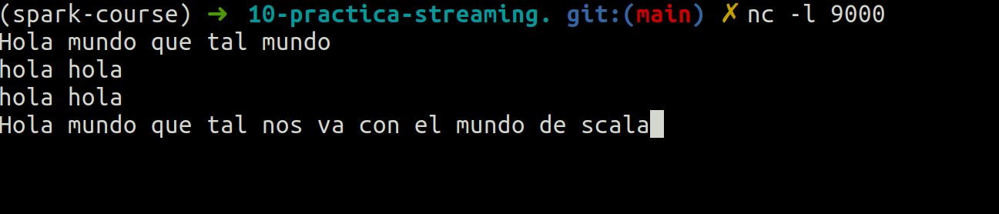
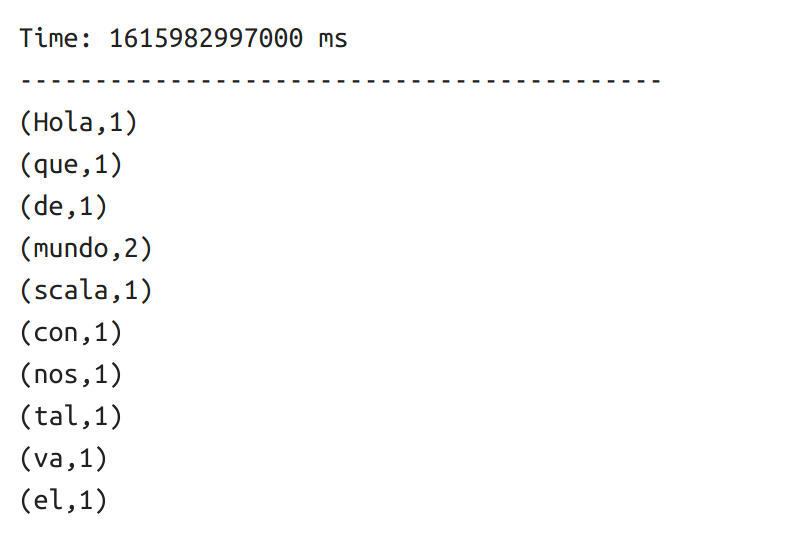

# 10-practica-streaming
0. [Que queremos obtener ](#schema0)
1. [Arrancar Zeppelin ](#schema1)
2. [Importación de librerías ](#schema2)
3. [Creando las variables de conexión](#schema3)
4. [Crear socket](#schema4)
5. [Ponemos a la escucha el programa](#schema5)

# 1. Arrancar Zeppelin
Navegamos en la consola hasta llegar donde tenemos descargados la carpeta Zeppelin y ejecutamos:
~~~
bin/zeppelin-daemon.sh start
~~~

Seguidamente abrimos un página en el navegador y vamos a `http://localhost:8080`, se nos abre zeppelin y creamos un nuevo notebook, llamado Temperatura Sensor y como intérprete elegimos `spark2`

# 2. Importación de librerías

~~~scala
import org.apache.spark.SparkConf
import org.apache.spark.storage.StorageLevel
import org.apache.spark.streaming.{Seconds, StreamingContext}
~~~

# 3. Creando las variables de conexión

`sparkConf` crea la configuración y le da el nombre a la aplicación
`scc` = streaming spakr context, variable que cada 1 segundo va a recoger los datos.

~~~scala
val sparkConf = new SparkConf().setAppName("StreamingWords")
val scc = new StreamingContext(sc, Seconds(1))
~~~
Hay que tener cuidado con los segundos que ponemos porque podemos perder inforamción.

# 4. Crear socket
~~~scala
val lineas = ssc. socketTextStream("localhost", 9000, StorageLevel.MEMORY_AND_DISK_SER)
~~~
Vamos a poner a la escucha el programa a través de un socket, que nos permite recibir una cascada de datos en formtato texto.
Le tenemos que decir de donde vamos a obtener los datos, en nuestro caso `localhost`, el puerto `9000`.
Y si la ingesta de datos va a ser muy grande lo que debemos hacer es una aproximación de memoria híbrida, memoria y disco. En nuestro caso vamos a usar el `StorageLevel.MEMORY_AND_DISK_SER` porque además de utilizar la memoria y el disco los datps los guarda serializados ocupando menos espacio.
Ahora vamos a poner a contar palabras
~~~scala
val palabras = lineas.flatMap(linea => linea.split(" "))
val contadorPalabras = palabras.map(x => (x,1)).reduceByKey((x,y) => x + y)
contadorPalabras.print()
~~~

# 5. Ponemos a la escucha el programa
~~~scala
ssc.start()
ssc.awaitTermination()
~~~

# 6. Instalamos netcat
`netcat` lo vamos a usar para crear el consumidor, por eso hay que instalarlo.

~~~
sudo apt-get update
sudo apt-get install netcat
~~~
Para ejecutarlo `-l` = `localhost` y `9000` puerto de escucha
~~~
nc -l 9000
~~~

